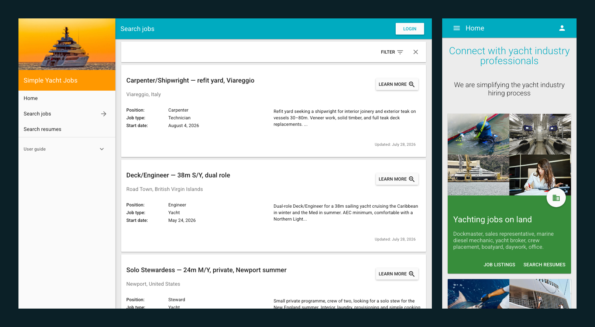

# simplejobs

A crew job board for the yacht industry. Captains post positions, crew post
résumés, both sides search.



An Angular 1.5 client on an Express + MongoDB API, written in 2016. It runs on
a laptop and is not deployed anywhere — treat it as a demo, not a product.

## Running It

Needs Docker and [nvm](https://github.com/nvm-sh/nvm). The `.nvmrc` pins Node
12.22.9, which is what this code was written for; newer Node cannot install its
dependency tree.

```bash
git clone https://github.com/adam-s/simplejobs.git
cd simplejobs
docker run -d --name simplejobs-mongo -p 27017:27017 mongo:4.4
nvm install && nvm use
npm install
npm run build           # bower vendor bundle + dart-sass
npm run seed            # 15 job listings, 5 crew listings, always the same ones
npm start               # → http://localhost:3000
```

Sign in as `demo@example.com` / `demo-password`. Seeded, local-only, recreated
by every `npm run seed`.

`./scripts/verify-clone.sh` clones the repo into a temp directory and runs the
install/build/seed/start sequence above against it, then checks the API and the
client actually answer — so the block above cannot quietly rot. It uses whatever
Node you invoke it with, so `nvm use` first.

## Tests

```bash
npm test              # 47 Mocha specs — models, routes, storage, auth (Node 12)
npm run test:e2e      # 10 Playwright specs against a running server (Node 24)
npm run snapshot      # 7 states × 3 viewports → PNGs + aria trees (Node 24)
```

The two Node versions are not a mistake: the server needs 12, Playwright needs
a current one. Switch with `nvm use` between them.

## Notes

Résumés are stored on local disk rather than S3, and the Mailgun and reCAPTCHA
calls in registration are behind config flags that are off locally — so no
account anywhere is needed to run it.

The Mocha suite reported green for eight years while running a single file,
because of a `describe.only` left in an AWS spec. Removing it exposed years of
drift between the tests and the working code; in every case the test was the
thing that was wrong. The app as it was abandoned is on the
[`original`](../../tree/original) branch.
